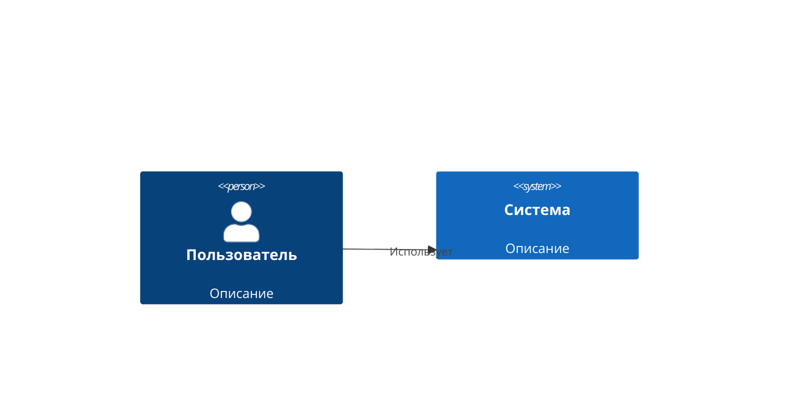
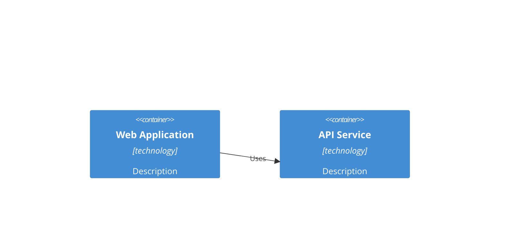

# Генерация Архитектуры системы из принятых требований

## Задача
Создать начальную версию Архитектуры системы на основе принятых требований и Конституции проекта.

## Входные данные
1. **Принятые требования** — список требований со статусом `accepted`
2. **Конституция проекта** — технологический стек, стандарты, ограничения
3. **Контекст проекта** — название, домен, основная цель

## Цель
Создать документ "Архитектура системы" который:
- Описывает высокоуровневую структуру системы
- Определяет основные компоненты и их взаимодействие
- Учитывает требования из принятого списка
- Соответствует технологическому стеку из Конституции
- Закладывает основу для последующих ADR (Architecture Decision Records)

## Правила создания Архитектуры

### Что должна включать Архитектура:

1. **Обзор системы (System Overview)**
   - Назначение системы
   - Основные пользователи и сценарии использования
   - Контекст системы (System Context Diagram)

2. **Архитектурные принципы (Architectural Principles)**
   - Ключевые решения и ограничения
   - Инварианты архитектуры
   - Принципы масштабирования

3. **Компоненты системы (System Components)**
   - Основные модули/сервисы
   - Ответственность каждого компонента
   - Интерфейсы между компонентами

4. **Хранение данных (Data Storage)**
   - Модели данных
   - Выбор баз данных (согласно Конституции)
   - Стратегии кэширования

5. **Интеграции (Integrations)**
   - Внешние сервисы и API
   - Протоколы коммуникации
   - Очереди сообщений (если применимо)

6. **Технологический стек (Technology Stack)**
   - Языки программирования (из Конституции)
   - Фреймворки (из Конституции)
   - Инфраструктура

7. **Безопасность (Security)**
   - Модель аутентификации и авторизации
   - Защита данных
   - Безопасность API

8. **Развёртывание (Deployment)**
   - Инфраструктура
   - CI/CD пайплайны
   - Мониторинг и логирование

### Что НЕ включать в начальную Архитектуру:
- ❌ Детали реализации конкретных функций
- ❌ Код или псевдокод
- ❌ Детальные диаграммы классов
- ❌ Спецификации API (это будет в задачах)

## Инструкция для LLM

Проанализируй принятые требования и Конституцию, затем создай Архитектуру системы:

### Шаг 1: Анализ требований
- Определи функциональные требования (FR)
- Определи нефункциональные требования (NFR)
- Выяви ключевые ограничения и зависимости

### Шаг 2: Соответствие Конституции
- Используй технологический стек из Конституции
- Соблюдай стандарты и принципы из Конституции
- Учитывай ограничения инфраструктуры

### Шаг 3: Проектирование архитектуры
- Определи основные компоненты системы
- Опиши взаимодействие между компонентами
- Выбери паттерны архитектуры (микросервисы, монолит, event-driven, и т.д.)

### Шаг 4: Документирование
- Структурируй документ по разделам (см. выше)
- Используй чёткий, технический язык
- Добавь диаграммы в формате Mermaid (если применимо)

## Формат ответа

Верни **полный текст Архитектуры системы** в формате Markdown, готовый к сохранению в файл `ARCHITECTURE.md`.

### Рекомендуемая структура:

```markdown
# Архитектура системы {Название} (System Architecture)

## 1. Обзор системы (System Overview)
### 1.1 Назначение системы
### 1.2 Пользователи и роли
### 1.3 Контекст системы



## 2. Архитектурные принципы (Architectural Principles)
### 2.1 Ключевые решения
### 2.2 Инварианты
### 2.3 Принципы масштабирования

## 3. Компоненты системы (System Components)
### 3.1 Обзор компонентов
### 3.2 Детали компонентов
### 3.3 Взаимодействие



## 4. Хранение данных (Data Storage)
### 4.1 Модель данных
### 4.2 Выбор баз данных
### 4.3 Кэширование

## 5. Интеграции (Integrations)
### 5.1 Внешние сервисы
### 5.2 Протоколы
### 5.3 Очереди сообщений

## 6. Технологический стек (Technology Stack)
### 6.1 Backend
### 6.2 Frontend
### 6.3 Инфраструктура

## 7. Безопасность (Security)
### 7.1 Аутентификация и авторизация
### 7.2 Защита данных
### 7.3 Безопасность API

## 8. Развёртывание (Deployment)
### 8.1 Инфраструктура
### 8.2 CI/CD
### 8.3 Мониторинг и логирование

## 9. Следующие шаги (Next Steps)
- [ ] Создать ADR для ключевых архитектурных решений
- [ ] Детализировать компоненты
- [ ] Определить API контракты
```

## Критерии качества

- ✅ Все принятые требования учтены в архитектуре
- ✅ Технологический стек соответствует Конституции
- ✅ Архитектура масштабируема и поддерживаема
- ✅ Компоненты имеют чёткую ответственность
- ✅ Документ структурирован и читаем
- ✅ Использованы диаграммы Mermaid для наглядности
- ✅ Заголовки разделов двуязычные (English + Русский)

## Связь с другими артефактами

- **Constitution** → ограничения и стек технологий
- **Requirements** → функциональные и нефункциональные требования
- **ADR (Architecture Decision Records)** → детальные решения по архитектуре
- **DevPlan** → план реализации архитектуры
